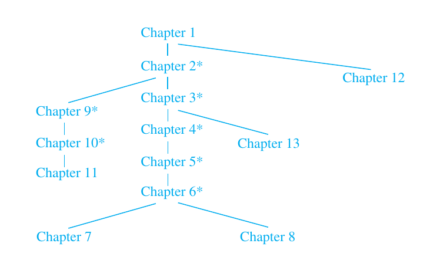
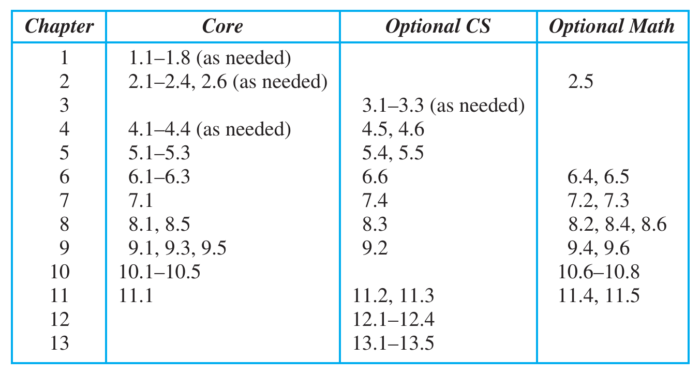
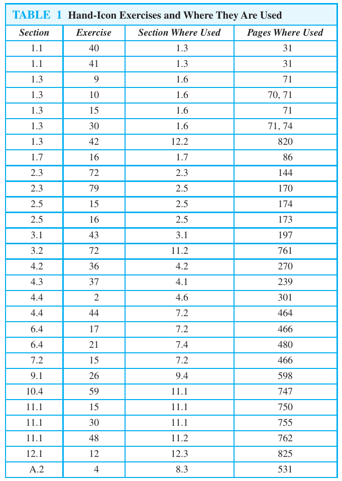

# Rosen, Discrete Mathematics and Its Applications, 7th Edition

## Bookmarks

| Section | Figure  | Title                                | Page |
| :-----: | ------- | ------------------------------------ | ---- |
|   1.3   | Table 6 | Logical Equivalences                 | 48   |
|   1.3   | Table 7 | Logical Equivalences of Conditionals | 49   |
|   1.6   | Table 1 | Rules of Inference                   | 93   |
|   2.2   | Table 1 | Set Identities                       | 151  |
|   2.3   | Table 1 | Properties of Floor and Ceiling      | 171  |
|   2.4   | Table 1 | Sequences                            | 183  |
|   2.4   | Table 2 | Summations                           | 187  |

## History

| Chapter |   Pages | # of Pages |     From |       To |
| ------: | ------: | ---------: | -------: | -------: |
|     All |   1-888 |        888 | 20.10.23 |          |
|       1 |   1-114 |        114 | 20.10.23 | 19.01.24 |
|       2 | 115-190 |         76 | 19.01.24 | 13.04.24 |
|       3 | 191-237 |         46 | 13.04.24 |          |

### Results

| Section | Exercises | Incorrect | Partly Correct | Correct | n.u. | diff. | % Correct |
| ------: | --------: | --------: | -------------: | ------: | ---: | ----: | --------: |
|       . |         0 |         0 |              0 |       0 |    0 |   0/0 |         0 |
|     1.1 |       101 |         9 |              0 |      92 |    0 |   0/0 |        91 |
|     1.2 |        26 |         8 |              1 |      17 |    0 |   0/1 |        67 |
|     1.3 |       100 |        16 |              0 |      84 |    0 |   3/4 |        84 |
|     1.4 |       226 |        32 |              0 |     194 |    0 |   0/0 |        86 |
|     1.5 |       238 |        47 |              0 |     191 |    1 |   1/5 |        80 |
|     1.6 |        73 |        13 |              2 |      58 |    0 |   2/2 |        81 |
|     1.7 |        44 |        21 |              1 |      22 |    0 |   0/0 |        52 |
|     1.8 |        53 |        25 |              5 |      23 |    1 |   2/7 |        48 |
|     1.R |        28 |         5 |              4 |      19 |    0 |   0/0 |        75 |
|     1.S |        67 |        17 |              1 |      49 |    5 |   0/0 |        74 |
|       1 |         - |         - |              - |       - |    7 |  8/19 |        74 |
|     2.1 |       115 |        21 |              0 |      94 |    0 |   1/3 |        82 |
|     2.2 |       141 |        26 |              1 |     114 |    0 |   1/2 |        81 |
|     2.3 |       194 |        56 |              2 |     136 |    1 |   1/3 |        71 |
|     2.4 |       161 |        52 |              3 |     106 |    3 |   0/3 |        67 |
|     2.5 |        59 |        30 |              2 |      27 |    3 |  3/10 |        47 |
|     2.6 |        64 |        15 |              1 |      48 |    1 |   0/0 |        76 |
|     2.R |        32 |         6 |              0 |      26 |    0 |   0/0 |        81 |
|     2.S |        58 |        27 |              2 |      29 |    0 |   1/6 |        52 |
|       2 |         - |         - |              - |       - |    8 |  7/25 |        70 |

- parts of exercises are counted separately
- 0, 0.5 (partly correct) or 1 point per exercise
- ex. skipped because too easy count as correctly solved
- ex. skipped because too difficult count as incorrect
- ex. skipped without reason are not counted

## Structure

### Sections requiring calculus

| Section | Title                   | Module |
| :-----: | ----------------------- | ------ |
|   3.2   | The Growth of functions | CS     |
|   5.1   | Mathematical Induction  | CS     |
|   5.5   | Program Correctness     |        |
|   7.3   | Bayes Theorem           | M      |
|   8.4   | Generating Functions    | M      |
|   9.5   | Equivalence Relations   |        |

## Symbols

|   Symbol    | Meaning                                      |
| :---------: | -------------------------------------------- |
|      ❌      | Wrong answer                                 |
|      ⭕      | Missing answer                               |
|      ❓      | Not Attempted (too difficult)                |
|      ❕      | Not Attempted (too easy)                     |
|      ❔      | Not Attempted (skipped)                      |
|      ❎      | Correct (with a different possible solution) |
|      ✅      | Correct (from solutions guide)               |
|      ✔      | Additional Info (from solutions guide)       |
| ⚠️ / ⚠️ ... ⚠️ | Unable to understand / to understand part    |

## Abbreviations

| Abbreviation | Meaning                     |
| :----------: | --------------------------- |
|     SSG      | Students Solutions Guide    |
|     ISG      | Instructors Solutions Guide |
|     bd.      | By definition               |
|    btdo.     | By the definition of        |
|    wlog.     | Without loss of generality  |
|     lhs.     | left-hand-side              |
|     rhs.     | right-hand-side             |

## Keymap (PC-German)

| Modifier      | Key  | Symbol |
| :------------ | :--- | :----- |
| altgr         | 6    | ¬      |
|               | Z    | ←      |
|               | U    | ↓      |
|               | I    | →      |
|               | O    | ø      |
|               | ,    | ·      |
|               | .    | …      |
| shift + altgr | 9    | ±      |
|               | U    | ↑      |
|               | O    | Ø      |
|               | ,    | ×      |
|               | .    | ÷      |
